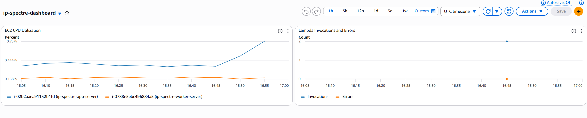
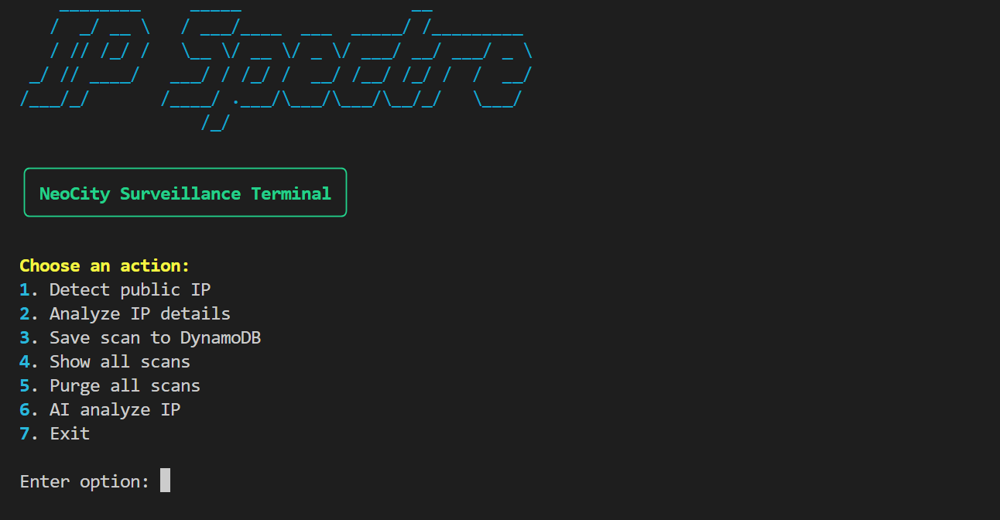
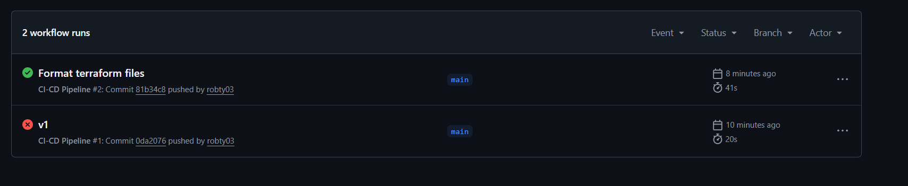

# Architect of the Net

Final cloud project built with AWS, Terraform, Docker, Lambda, API Gateway, CloudWatch, Makefile, and GitHub Actions.

## Architecture

The platform contains the following main components:

- **VPC**
  - Custom VPC in AWS
  - Two public subnets in `eu-west-1a` and `eu-west-1b`
- **EC2**
  - One application server
  - One worker server
- **Security Group**
  - SSH access on port 22
  - HTTP access on port 80
- **IAM**
  - Lambda execution role
  - EC2 role with access to DynamoDB and SSM
- **Lambda**
  - Serverless IP validation function
- **API Gateway**
  - Public HTTP endpoint for Lambda
- **CloudWatch**
  - Dashboard with EC2 CPU and Lambda metrics
- **Docker**
  - Containerized CLI application
- **GitHub Actions**
  - CI/CD pipeline for validation and build

  ## Problems encountered

  At the beginning, I had a problem when copying the project to EC2, because at first I tried to copy the whole folder and it included too many unnecessary files, which made the transfer look like it was stuck in a loop. I fixed that by copying only the required project folders.

  Another issue appeared when I started extending the infrastructure with Lambda and API Gateway. Terraform initially wanted to recreate the EC2 instances because the AMI reference changed, so I had to stabilize the configuration to avoid unnecessary destroy and recreate actions.

  On the CI/CD side, the first GitHub Actions workflow failed and showed red because the Terraform files were not formatted correctly yet, so the `terraform fmt -check` step failed. After formatting the Terraform files properly and pushing again, the workflow passed successfully.

  ## Screenshots

  ### CloudWatch Dashboard
  

  ### CLI Application
  

  ### GitHub Actions Workflow
  